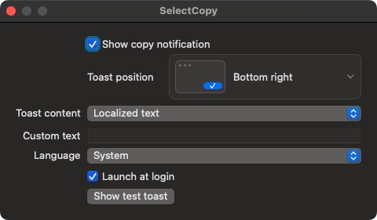

# SelectCopy

SelectCopy is a small macOS menu-bar utility that copies text immediately after you select it with the mouse. It supports Accessibility API reads with a safe Cmd-C fallback, a configurable confirmation toast, launch-at-login, six toast positions, custom text/icon-only mode, and English/Russian/system language.

## Screenshots

### Settings

Configure the notification, toast position, text, language, and launch at login.



## Requirements

- macOS 13 Ventura or newer
- Accessibility permission in System Settings → Privacy & Security → Accessibility
- Xcode 16 or newer with Swift 6 (XcodeGen is used to generate the project)

## Build

```sh
brew install xcodegen
xcodegen generate
xcodebuild test -project SelectCopy.xcodeproj -scheme SelectCopy -destination 'platform=macOS'
```

For a local installation that retains Accessibility permission across updates:

```sh
make install-local
```

See [persistent local signing](docs/LOCAL_SIGNING.md).

## Compatibility

This is an early development version. Selection detection depends on each
application's Accessibility support. Some applications require the Cmd-C fallback;
terminal compatibility is still being validated. Password fields are excluded.

Local builds are not notarized distribution releases. The local signing identity
is created on your Mac and must not be shared or committed.

SelectCopy never keeps a copy history. Clipboard contents are restored when the fallback copy path encounters non-text data or fails.

## License

MIT. See [LICENSE](LICENSE).
